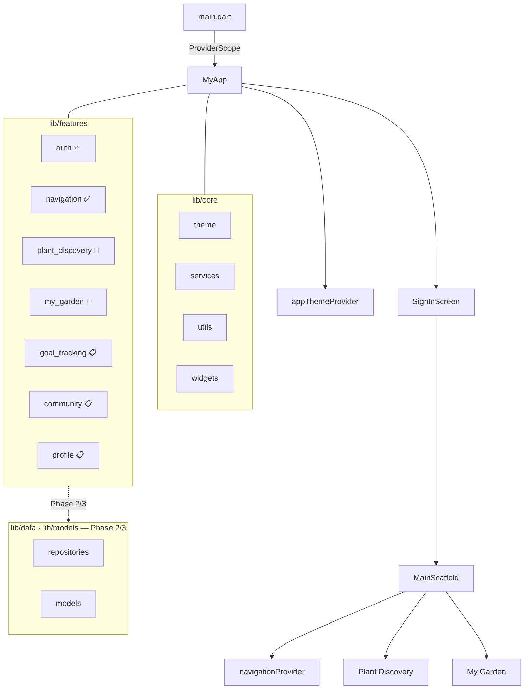

# Planthor

> From Plan to Performance

Planthor is a Flutter application for plant enthusiasts to discover plants, manage their personal garden, and stay on top of care schedules through reminders and goal tracking.

## Tech Stack

| Layer | Technology |
|-------|------------|
| Framework | Flutter |
| Language | Dart ≥ 3.11.5 |
| State Management | Riverpod 2.x (`riverpod_generator`) |
| Architecture | Feature-First Clean Architecture |
| Code Generation | `build_runner` |

## Features

| Feature | Phase | Status |
|---------|-------|--------|
| Authentication (Sign In) | Phase 1 | ✅ Complete |
| App Navigation | Phase 1 | ✅ Complete |
| Theme & Design System | Phase 1 | ✅ Complete |
| Plant Discovery | Phase 2 | 🚧 In Progress |
| My Garden | Phase 2 | 🚧 In Progress |
| Goal Tracking & Reminders | Phase 3 | 📋 Planned |
| Community | Phase 3 | 📋 Planned |
| Profile | Phase 3 | 📋 Planned |

See [TODO.md](TODO.md) for the full roadmap.

## Prerequisites

- Flutter SDK (compatible with Dart ≥ 3.11.5) — install via [flutter.dev](https://flutter.dev/docs/get-started/install)
- Xcode (for iOS builds)
- Android Studio / Android SDK (for Android builds)

## Setup

```bash
# Install dependencies
flutter pub get

# Generate Riverpod providers and code
dart run build_runner build --delete-conflicting-outputs

# Verify no analysis issues
flutter analyze

# Run the app
flutter run
```

> Re-run `build_runner` whenever you modify a provider or annotated model.

## Architecture



## Project Structure

```
lib/
├── main.dart                  # App entry point
├── core/
│   ├── theme/                 # AppTheme, AppColors, AppTypography
│   ├── services/              # Shared services
│   ├── utils/                 # Utility helpers
│   └── widgets/               # Shared UI components
├── features/
│   ├── auth/                  # Sign-in screen (Phase 1 ✅)
│   ├── navigation/            # Bottom nav scaffold (Phase 1 ✅)
│   ├── plant_discovery/       # Browse plants (Phase 2 🚧)
│   ├── my_garden/             # Personal collection (Phase 2 🚧)
│   ├── goal_tracking/         # Care reminders (Phase 3 📋)
│   ├── community/             # Social features (Phase 3 📋)
│   └── profile/               # User settings (Phase 3 📋)
├── data/                      # Repositories & data sources (Phase 2+ 📋)
└── models/                    # Shared domain models (Phase 2+ 📋)
```

## Contributing

See [CONTRIBUTING.md](CONTRIBUTING.md) for development workflow, coding standards, and the PR process.
